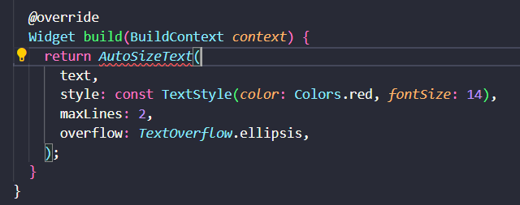
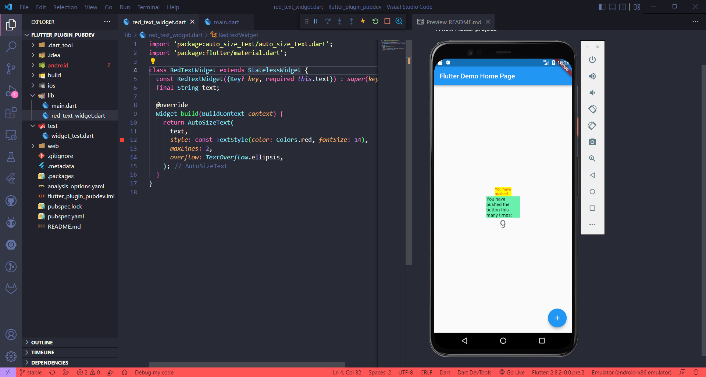

# flutter_plugin_pubdev

A new Flutter project.

## PRAKTIKUM

Error terjadi karena package auto_size belum terimport pada bagian main.dart karena baris return merupakan Costructor dari class AutoSizeText. 

1.	Jelaskan maksud dari langkah 2 pada praktikum tersebut!
    
    <mark>Jawab :

    Menambahkan plugin auto_size_text ke dalam project sehingga plugin tersebut dapat secara otomatis terdeklarasi di dalam pubspec.yml atau terbentuk depency baru. Dimana package tersebut nantinya berfungsi agar secara otomatis mengubah ukuran teks agar presize dengan sempurna 

2.	Jelaskan maksud dari langkah 5 pada praktikum tersebut!

    <mark>Jawab :
    
    Langkah 5 adalah membuat variabel text yang nantinya dijadikan key yang bersifat required sesuai dengan parameter yang ada di contructor AutoSizeText

3.	Pada langkah 6 terdapat dua widget yang ditambahkan, jelaskan fungsi dan perbedaannya!

    <mark>Jawab :
    
    Cotainer pertama memiliki warna kuning sedangkan container kedua berwana greenAccent. Cotainer pertama memiliki width 50  sedangkan container kedua width 100.
    
    Cotainer pertama memiliki child berupa widget yang dibuat dari class red_text_widget dimana mengacu pada sutosize sehingga yang tampil hanya kata yang cukup untuk width sedangkan container menggunaan widget yang telah disediakan flutter

1.	Jelaskan maksud dari tiap parameter yang ada di dalam plugin auto_size_text

    <mark>Jawab :
    
    •	maxLines
    
    maxLines berfungsi untuk mebatasi baris konten sesuai dengan value yang ditentukan.Jika tidak ada parameter maxLines yang ditentukan, AutoSizeText hanya cocok dengan teks sesuai dengan lebar dan tinggi yang tersedia
    
    •	minFontSize & maxFontSize
    Dengan minFontSize dapat menentukan ukuran font sekecil mungkin. Jika teks masih tidak sesuai secara otomatis mnejadi overflow. minFontSize default adalah 12.maxFontSize menetapkan ukuran font terbesar yang mungkin. Ini berguna jika TextStyle mewarisi ukuran font dan Anda ingin membatasinya.
    
    •	Group
    
    Digunakan untuk menyinkronkan ukutan font dimana disesuaikan dengan boundaries dan semua AutoSizeText yang berada di group yang sama memiliki ukuran yang sama. Diperlukan instance dari AutoSizeGroup.
    
    •	stepGranulary 
    
    stepGranularity menentukan seberapa besar ukuran font dikurangi setiap langkah
    
    •	presetFontSizes
    
    Digunakan apabila hanya menginginkan ukuran font tertentu, maka dapat diatur  dengan presetFontSizes. Jika presetFontSizes diatur, minFontSize, maxFontSize dan stepGranularity akan diabaikan
    
    •	overflowReplacement
    Digunakan agat teks tetap dapat dibaca dan tidak terlalu kecil akibat dari adanya overflow dan tidak sesuainya dengan boundaries

